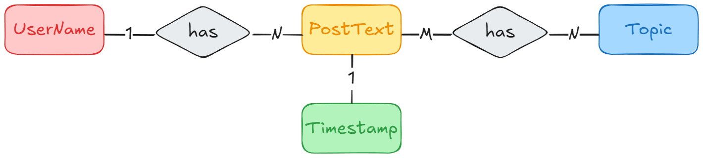
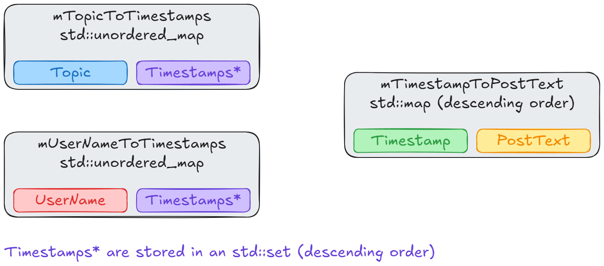

# Yodelr

[](https://github.com/xorz57/yodelr/actions/workflows/Build.yml)

## Diagrams





## How to Build

```bash
git clone https://github.com/xorz57/yodelr.git
cd yodelr
cmake -B build -DCMAKE_BUILD_TYPE=Release -S .
cmake --build build --config Release
ctest --build-config Release
```
