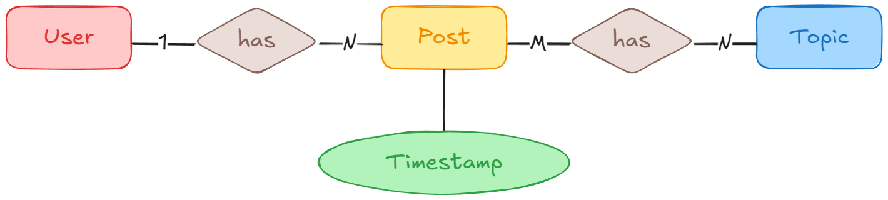

# Yodelr

This repository contains my solution to the Vespa.ai coding challenge. I decided to make this project public to showcase my work and provide transparency about my experience during the interview process.

## Interview Process and Notes

I participated in Vespa.ai’s recruitment process, which spanned over **three weeks**. Throughout the process, I was upfront about my **two years of experience**, clearly stated in my resume. Despite this, Vespa.ai proceeded with multiple interview stages without signaling any issues regarding my qualifications.

However, after dedicating time to prepare and participate in several rounds of interviews, I was ultimately informed that I was not selected due to my **lack of experience**. This feedback came as a surprise, as there were no indications throughout the process that my experience would be a limiting factor.

While I am grateful for the opportunity, I believe the process could have been more efficient and transparent, saving time for both parties. I hope this project serves as a demonstration of my abilities and the effort I put into the challenge.

| Date       | Description                                                                                               |
| ---------- | --------------------------------------------------------------------------------------------------------- |
| 2024/09/19 | Initial interview with the founder. I received the coding challenge.                                      |
| 2024/09/23 | Submitted my solution to the coding challenge.                                                            |
| 2024/10/07 | Technical interview. The interview went well, with no indication of any issues.                           |
| 2024/10/09 | Received a rejection letter, citing lack of experience as the reason for not moving forward.              |

## Diagram



## How to Build

```bash
git clone https://github.com/xorz57/yodelr.git
cd yodelr
cmake -B build -DCMAKE_BUILD_TYPE=Release -S .
cmake --build build --config Release
ctest --test-dir build --build-config Release
```
